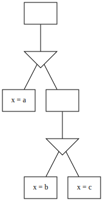

# Decision Trees

**Decision Trees** contain **Constraint Nodes** and **Decision Nodes**:

* Constraint Nodes contain atomic constraints and a set of decision nodes, and are satisfied by an data entry if it satifies all atomic constraints and decision nodes.
* Decision Nodes contain Constraint Nodes, and are satisfied if at least one Constraint Node is satisfied.

Every Decision Tree is rooted by a single Constraint Node.

## Example

In our visualisations, we notate constraint nodes with rectangles and decision nodes with triangles.

## Derivation

Given a set of input constraints, we can build an equivalent Decision Tree.

One process involved in this is **constraint normalisation**. We transform constraints by applying a number of logical equivalences. Each equivalence consumes one constraint and outputs a set of replacement constraints.

* `¬¬X` => `[ X ]`
* `AND(X, Y)` => `[ X, Y ]`
* `¬OR(X, Y, ...)` => `[ ¬X, ¬Y, ... ]`
* `¬AND(X, Y, ...)` => `[ OR(¬X, ¬Y, ...) ]`
* `¬IF(X, Y)` => `[ X, ¬Y ]`
* `¬IFELSE(X, Y, Z)` => `[ OR(AND(X, ¬Y), AND(¬X, ¬Z)) ]`

We can convert a set of constraints to a Constraint Node as follows:

1. Normalise the set of constraints
2. Take each constraint in sequence:
    * If the constraint is atomic, add it to the Constraint Node
    * If the constraint is an `OR`, add a Decision Node. Convert the operands of the `OR` into Constraint Nodes
    * If the constraint is an `IF(X, Y)`, add a Decision Node with two Constraint Nodes. One is converted from `AND(X, Y)`, the other from `¬X`
    * If the constraint is an `IFELSE(X, Y, Z)`, add a Decision Node with two Constraint Nodes. One is converted from `AND(X, Y)`, the other from `AND(¬X, Z)`

## Optimisation

As a post-processing step, we apply [optimisations](./Optimisation.md) to yield equivalent but more tractable trees.
