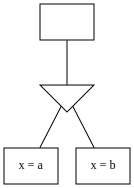
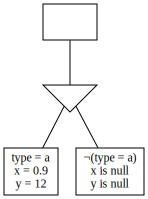
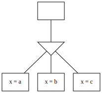
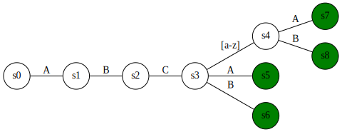

<div>
    <a href="https://finos.github.io/datahelix/">
        
    </a>
</div>

# Introduction

This guide outlines how to contribute to the project as well as the key concepts and structure of the DataHelix.

* For information on how to get started with DataHelix see our [Getting Started guide](GettingStarted.md).

* For information on the syntax of the DataHelix schema see the [User Guide](UserGuide.md).

# Table of Contents


1. [Development](#Development)

    1. [Bugs And Issues](#bugs-and-issues)
    1. [Building](#Building)
    1. [Testing](#Testing)
    1. [Contributing](#Contributing)
    1. [Adding Schema Versions](#Adding-Schema-Versions)

1. [Principles](#Principles)
    1. [Architectural](#Architectural-Principles)

1. [Algorithms and Data Structures](#Algorithms-and-Data-Structures)

    1. [Decision Trees](#decision-trees)
        1. [Example](#decision-trees-example)
        1. [Derivation](#derivation)
        1. [Optimisation](#optimisation)
    1. [Generation Algorithm](#decision-tree-generation)
        1. [Decision tree interpretation](#Decision-tree-interpretation)
        1. [Constraint reduction](#Constraint-reduction)
        1. [Databags](#Databags)
        1. [Output](#output)
    1. [String Generation](#String-Generation)
    1. [Tree Walking Algorithm](#Tree-Walking-Algorithm)

1. [Behaviour in Detail](Behaviour-in-Detail)

    1. [Null Operator](#Null-Operator)
    1. [Null Operator with If](#Null-Operator-with-If)
    1. [Nullness](#nullness)
    1. [Type Implication](#Type-Implication)

# Development

## Bugs and Issues

Raising well structured and detailed bug reports is hugely valuable to maturing the DataHelix.

Checklist before raising an issue:
* [ ] Have you [searched for duplicates](https://github.com/finos/datahelix/issues?utf8=%E2%9C%93&q=)?  A simple search for exception error messages or a summary of the unexpected behaviour should suffice.
* [ ] Are you running the latest version?
* [ ] Are you sure this is a bug or missing capability?
* [ ] Have you managed to isolate the issue to a simple profile or test case?

### Raising an Issue
* Use the [create your issue](https://github.com/finos/datahelix/issues/new) page and select the relevant issue template.

* Please also tag the new issue with a relevant tag.
* Please use [Markdown formatting](https://help.github.com/categories/writing-on-github/) liberally to assist in readability.
  * [Code fences](https://help.github.com/articles/creating-and-highlighting-code-blocks/) for exception stack traces and log entries, for example, massively improve readability.

## Building

DataHelix uses Java 1.8 which can be downloaded from this [link](http://www.oracle.com/technetwork/java/javase/downloads/jdk8-downloads-2133151.html)

DataHelix uses [gradle](https://gradle.org/) to automate the build and test process. To build the project run `gradle build` from the root folder of the project. If it was successful then the created jar file can be found in the path _orchestrator/build/libs/datahelix.jar_ .

[Guice](https://github.com/google/guice) is used in DataHelix for Dependency Injection (DI). It is configured in the 'module' classes, which all extend `AbstractModule`, and injected with the `@inject` annotation.

## Testing

To run the tests for DataHelix run `gradle test` from the root folder of the project.

Our strategy is to ensure all aspects of the generator are tested through some form of automation testing as we strive to ensure correctness, quality and prevent against regression issues.

* For all new classes and methods that are developed, unit or component tests should be added to the code base

* If a change is made to existing class implementations and a test does not exist, then a test should be added

[JUnit (Jupiter)](https://junit.org/junit5/docs/current/user-guide/) is used for unit and integration tests. The [JUnit Cookbook](./developer/JUnitCookbook.md) shows an outline of how unit tests should be written within DataHelix.

[Cucumber](https://cucumber.io/) is used for behaviour driven development and testing, with [gherkin](https://docs.cucumber.io/gherkin/)-based tests.

Below is an example of a Cucumber test:

```gherkin
Feature: the name of my feature

  Background:
    Given the generation strategy is random
    And there is a non nullable field foo

  Scenario: Running the generator should emit the correct data
    Given foo is equal to 8
    Then the following data should be generated:
      | foo  |
      | 8    |
      | null |
```

More examples can be seen in the [generator Cucumber features](https://github.com/finos/datahelix/tree/master/orchestrator/src/test/java/com/scottlogic/datahelix/generator/orchestrator/cucumber). The [Cucumber Cookbook](./developer/CucumberCookbook.md) shows an outline of how Cucumber is used within DataHelix.

## Contributing

1. Fork it (<https://github.com/yourname/yourproject/fork>)
2. Create your feature branch (`git checkout -b feature/fooBar`)
3. Read our [contribution guidelines](../.github/CONTRIBUTING.md) and [Community Code of Conduct](https://www.finos.org/code-of-conduct)
4. Commit your changes using our [Commit Guidelines](../.github/CONTRIBUTING.md#commit-and-pr-messages)
5. Push to the branch (`git push origin feature/fooBar`)
6. Create a new Pull Request

_NOTE:_ Commits and pull requests to FINOS repositories will only be accepted from those contributors with an active, executed Individual Contributor License Agreement (ICLA) with FINOS OR who are covered under an existing and active Corporate Contribution License Agreement (CCLA) executed with FINOS. Commits from individuals not covered under an ICLA or CCLA will be flagged and blocked by the FINOS Clabot tool. Please note that some CCLAs require individuals/employees to be explicitly named on the CCLA.

*Need an ICLA? Unsure if you are covered under an existing CCLA? Email [help@finos.org](mailto:help@finos.org)*

# Principles
There are a number of principles that the DaraHelix suite of products should adhere to, in order to:
- improve usability
- provide additional ways of working
- support best practices
- be open about the services offered

## Architectural Principles
Some of the easiest principles to define, from a development perspective, are the architectural principles. 
In the below, a solution is considered to be something that is individually runnable by a user. The generator, being the composite of a number of modules, is the solution.

These are generally defined as:
- Each solution must have a single responsibility. I.e. the generator is responsible for generating data. Another solution can be responsible for transforming, relaying or otherwise using the output.
- Each solution must support inputs from DataHelix products and from elsewhere. I.e. tools to use the output of the generator should equally be able to use data produced by another tool, or from a saved file of content from a previous execution of the generator
- Each solution must have its own dedicated GitHub repository and should be open sourced through FINOS
- Each solution must have the same core dependencies as the others, i.e. don't change the version requirements of Java between the solutions
- Each solution must be able to operate offline. No online requirement should be included, even for version checking, notices, etc. This is to ensure that the products can meet the often stringent security rules of data sensitive businesses
- Each solution must be able to run on any platform, windows or Unix alike.
- Each solution should have in built help for running the product from the command line. For example a help screen if no arguments are supplied.
- Each solution should be installable from the command line where possible, for example via package managers. This can help with automation of testing, environmental setup and even creation of containers.

# Algorithms and Data Structures

## Decision Trees

**Decision Trees** contain **Constraint Nodes** and **Decision Nodes**:

* Constraint Nodes contain atomic constraints and a set of decision nodes, and are satisfied by an data entry if it satifies all atomic constraints and decision nodes.
* Decision Nodes contain Constraint Nodes, and are satisfied if at least one Constraint Node is satisfied.

Every Decision Tree is rooted by a single Constraint Node.

<div id="decision-trees-example"></div>

### Example

In our visualisations, we notate constraint nodes with rectangles and decision nodes with triangles.


### Derivation

Given a set of input constraints, we can build an equivalent Decision Tree.

One process involved in this is **constraint normalisation**, which transforms a set of constraints into a new set with equivalent meaning but simpler structure. This happens through repeated application of some known equivalences, each of which consumes one constraint and outputs a set of replacements:

| Input              | Outputs                       |
| ------------------ | ----------------------------- |
| `¬¬X`              | `X`                           |
| `AND(X, Y)`        | `X, Y`                        |
| `¬OR(X, Y, ...)`   | `¬X, ¬Y, ...`                 |
| `¬AND(X, Y, ...)`  | `OR(¬X, ¬Y, ...)`             |
| `¬IF(X, Y)`        | `X, ¬Y`                       |
| `¬IFELSE(X, Y, Z)` | `OR(AND(X, ¬Y), AND(¬X, ¬Z))` |

We can convert a set of constraints to a Constraint Node as follows:

1. Normalise the set of constraints
2. Take each constraint in sequence:
    * If the constraint is atomic, add it to the Constraint Node
    * If the constraint is an `OR`, add a Decision Node. Convert the operands of the `OR` into Constraint Nodes
    * If the constraint is an `IF(X, Y)`, add a Decision Node with two Constraint Nodes. One is converted from `AND(X, Y)`, the other from `¬X`
    * If the constraint is an `IFELSE(X, Y, Z)`, add a Decision Node with two Constraint Nodes. One is converted from `AND(X, Y)`, the other from `AND(¬X, Z)`


### Optimisation

As a post-processing step, we apply the following optimisations to yield equivalent but more tractable trees.

#### Partitioning

The expression of a field may depend on the expression of other fields. For instance, given `X = 3 OR Y = 5`, `Y` must be `5` if `X` is not `3`; `X` and `Y` can be said to _co-vary_. This covariance property is transitive; if `X` and `Y` co-vary and `Y` and `Z` co-vary, then `X` and `Z` also co-vary. Given this definition, it's usually possible to divide a profile's fields into smaller groups of fields that co-vary. This process is called **partitioning**.

For example, given the below tree:


We can observe that variations in `x` and `y` have no implications on one another, and divide into two trees:

 

The motivation for partitioning is to determine which fields can vary independently of each other so that streams of values can be generated for them independently (and potentially in parallel execution threads) and then recombined by any preferred [combination strategy](user/CombinationStrategies.md).

#### Unification

Consider the below tree:


It's impossible to [partition](#Partitioning) this tree because the `type` field affects every decision node. However, we can see that the below tree is equivalent:  



Formally: If you can identify pairs of sibling, equivalent-valency decision nodes A and B such that for each constraint node in A, there is precisely one mutually satisfiable node in B, you can collapse the decisions. There may be multiple ways to do this; the ordering of combinations affects how extensively the tree can be reduced.

#### Deletion

Consider the below tree:


Because the leftmost node contradicts the root node, we can delete it. Thereafter, we can pull the content of the other constraint node up to the root node. However, because `¬(x > 12)` is entailed by `x = 3`, we delete it as well. This yields:


#### Hoisting

Consider the below tree:


We can simplify to:



Formally: If a Decision Node `D` contains a Constraint Node `C` with no constraints and a single Decision Node `E`, `E`'s Constraint Nodes can be added to `D` and `C` removed.

This optimisation addresses situations where, for example, an `anyOf` constraint is nested directly inside another `anyOf` constraint.

## Decision tree generation

Given a set of rules, generate a [decision tree](#decision-trees) (or multiple if [partitioning](#partitioning) was successful).

### Decision tree interpretation

An interpretation of the decision tree is defined by chosing an option for every decision visited in the tree.


In the above diagram the red lines represent one interpretation of the graph, for every decision an option has been chosen and we end up with the set of constraints that the red lines touch at any point. These constraints are reduced into a fieldspec (see [Constraint Reduction](#constraint-reduction) below).

Every decision introduces new interpretations, and we provide interpretations of every option of every decision chosen with every option of every other option. If there are many decisons then this can result in too many interpretations.

### Constraint reduction

An interpretation of a decision tree could contain several atomic constraints related to a single field. To make it easier to reason about these collectively, we **reduce** them into more detailed, holistic objects. These objects are referred to as **fieldspecs**, and can express any restrictions expressed by a constraint. For instance, the constraints:

* `X greaterThanOrEqualTo 3`
* `X lessThanEqualTo 6`
* `X not null`

could collapse to

```
{
  min: 3,
  max: 6,
  nullability: not_null
}
```

*(note: this is a conceptual example and not a reflection of actual object structure)*

See [Set restriction and generation](user/SetRestrictionAndGeneration.md) for a more in depth explanation of how the constraints are merged and data generated.

This object has all the information needed to produce the values `[3, 4, 5, 6]`.

The reduction algorithm works by converting each constraint into a corresponding, sparsely-populated fieldspec, and then merging them together. During merging, three outcomes are possible:

* The two fieldspecs specify distinct, compatible restrictions (eg, `X is not null` and `X > 3`), and the merge is uneventful
* The two fieldspecs specify overlapping but compatible restrictions (eg, `X is in [2, 3, 8]` and `X is in [0, 2, 3]`), and the more restrictive interpretation is chosen (eg, `X is in [2, 3]`).
* The two fieldspecs specify overlapping but incompatible restrictions (eg, `X > 2` and `X < 2`), the merge fails and the interpretation of the decision tree is rejected

### Databags

A **databag** is an immutable mapping from fields to outputs, where outputs are a pairing of a *value* and *formatting information* (eg, a date formatting string or a number of decimal places).

Databags can be merged, but merging two databags fails if they have any keys in common.

Fieldspecs are able to produce streams of databags containing valid values for the field they describe. Additional operations can then be applied over these streams, such as:

* A memoization decorator that records values being output so they can be replayed inexpensively
* A filtering decorator that prevents repeated values being output
* A merger that takes multiple streams and applies one of the available [combination strategies](user/CombinationStrategies.md)
* A concatenator that takes multiple streams and outputs all the members of each

### Output

Once fieldspecs have generated streams of single-field databags, and databag stream combiners have merged them together, we should have a stream of databags that each contains all the information needed for a single datum. At this point, a serialiser can take each databag in turn and create an output.

To create a row the serialiser iterates through the fields in the profile, in order, and uses the field as a lookup for the values in the databag.

CSV and JSON formats are currently supported.

## String Generation

We use a Java library called [dk.brics.automaton](http://www.brics.dk/automaton/) to analyse regexes and generate valid strings based on them. It works by representing the regex as a finite state machine. It might be worth reading about state machines for those who aren't familiar: [https://en.wikipedia.org/wiki/Finite-state_machine](https://en.wikipedia.org/wiki/Finite-state_machine). Consider the following regex: `ABC[a-z]?(A|B)`. It would be represented by the following state machine:



The [states](http://www.brics.dk/automaton/doc/index.html) (circular nodes) represent a string that may (green) or may not (white) be valid. For example, `s0` is the empty string, `s5` is `ABCA`.

The [transitions](http://www.brics.dk/automaton/doc/index.html) represent adding another character to the string. The characters allowed by a transition may be a range (as with `[a-z]`). A state does not store the string it represents itself, but is defined by the ordered list of transitions that lead to that state.

Other than the fact that we can use the state machine to generate strings, the main benefit that we get from using this library are:
* Finding the intersection of two regexes, used when there are multiple regex constraints on the same field.
* Finding the complement of a regex, which we use for generating regexes for negated conditions.

Due to the way that the generator computes textual data internally the generation of strings is not deterministic and may output valid values in a different order with each generation run.

### Anchors

dk.brics.automaton doesn't support start and end anchors `^` & `$` and instead matches the entire word as if the anchors were always present. For some of our use cases though it may be that we want to match the regex in the middle of a string somewhere, so we have two versions of the regex constraint - [matchingRegex](UserGuide.md#predicate-matchingregex) and [containingRegex](UserGuide.md#predicate-containingregex). If `containingRegex` is used then we simply add a `.*` to the start and end of the regex before passing it into the automaton. Any `^` or `$` characters passed at the start or end of the string respectively are removed, as the automaton will treat them as literal characters.

### Automaton data types
The automaton represents the state machine using the following types:
- `Transition`
- `State`

#### `Transition`
A transition holds the following properties and are represented as lines in the above graph
- `min: char` - The minimum permitted character that can be emitted at this position
- `max: char` - The maximum permitted character that can be emitted at this position
- `to: State[]` - The `State`s that can follow this transition

In the above `A` looks like:

| property | initial | \[a-z\] |
| ---- | ---- | ---- |
| min | A | a |
| max | A | z |
| to | 1 state, `s1` | 1 state, `s4` |

#### `State`
A state holds the following properties and are represented as circles in the above graph
- `accept: boolean` - is this a termination state, can string production stop here?
- `transitions: HashSet<Transition>` - which transitions, if any, follow this state
- `number: int` - the number of this state
- `id: int` - the id of this state (not sure what this is used for)

In the above `s0` looks like:

| property | initial | s3 |
| ---- | ---- | ---- |
| accept | false | false |
| transitions | 1 transition, &rarr; `A` | 2 transitions:<br /> &rarr; `[a-z]`<br /> &rarr; `A|B` |
| number | 4 | 0 |
| id | 49 | 50 |

### Textual representation
The automaton can represent the state machine in a textual representation such as:

```
initial state: 4
state 0 [reject]:
  a-z -> 3
  A-B -> 1
state 1 [accept]:
state 2 [reject]:
  B -> 5
state 3 [reject]:
  A-B -> 1
state 4 [reject]:
  A -> 2
state 5 [reject]:
  C -> 0
```

This shows each state and each transition in the automaton, lines 2-4 show the `State` as shown in the previous section.
Lines 10-11 show the transition 'A' as shown in the prior section.

The pathway through the automaton is:
- transition to state **4** (because the initial - empty string state - is rejected/incomplete)
- add an 'A' (state 4)
- transition to state **2** (because the current state "A" is rejected/incomplete)
- add a 'B' (state 2)
- transition to state **5** (because the current state "AB" is rejected/incomplete)
- add a 'C' (state 5)
- transition to state **0** (because the current state "ABC" is rejected/incomplete)
   - _either_
      - add a letter between `a..z` (state 0, transition 1)
      - transition to state **3** (because the current state "ABCa" is rejected/incomplete)
      - add either 'A' or 'B' (state 3)
      - transition to state **1** (because the current state "ABCaA" is rejected/incomplete)
      - current state is accepted so exit with the current string "ABCaA"
   - _or_   
      - add either 'A' or 'B' (state 0, transition 2)
      - transition to state **1** (because the current state "ABCA" is rejected/incomplete)
      - current state is accepted so exit with the current string "ABCA"


# Behaviour in Detail

## Type System

The primary types (Numeric, String and Datetime) are exclusive - a field can only be one of these types. Other types are reduced to a constrained subset of the values of one of these types. For example, integers are a subset of the numeric type.

## Nullability

Nulls are considered orthogonal to the type system. A given field's possible values can be considered as the union between the value `null` and all of the possible values of the given type for the field.

Consider a field which permits the integers 1-3 inclusive which is nullable. This field would permit the following as possible values:

```{ null } ∪ { 1, 2, 3}```

## Null Precedence in Constraints

All constraints are considered to only operate on the set of typed values, not the null portion. This is due to the orthogonal nature of nulls in the system.

One way to interpret this is to consider the union of null and typed values separately at all times, where constraints only operate on the respective fields' typed values. If a given field is decided to be `null`, then it is left with no possible typed values - which we call the empty set (`{ }`).

For example, consider a pair of fields, each permitting a single integer and allowing null:

| field | values | nullable |
| ---- | ---- | ---- |
| `a` | ```{ 1, 2, 3 }``` | `true` |
| `b` | ```{ 1, 2 }``` | `true` |

with the equality relationship between them (ie. `a = b`).

This would give the following possible values:

| a | b | Why? |
| ---- | ---- | ---- |
| `1` | `1` | When `a` and `b` are not-null, the equality relation holds |
| `2` | `2` | When `a` and `b` are not-null, the equality relation holds |
| `1` | `null` | When `b` is null, the equality operation doesn't apply |
| `2` | `null` | When `b` is null, the equality operation doesn't apply |
| `3` | `null` | When `b` is null, the equality operation doesn't apply |
| `null` | `1` | When `a` is null, the equality operation doesn't apply |
| `null` | `2` | When `a` is null, the equality operation doesn't apply |
| `null` | `null` | When both are null, the equality operation doesn't apply |

If we break the above down into first the null state, then the chosen value:

| a null | b null | a typed | b typed |
| ---- | ---- | ---- | ---- |
| `{ NOT null }` | `{ NOT null }` | `{ 1 }` | `{ 1 }` |
| `{ NOT null }` | `{ NOT null }` | `{ 2 }` | `{ 2 }` |
| `{ NOT null }` | `{ null }` | `{ 1 }` | `{ }` |
| `{ NOT null }` | `{ null }` | `{ 2 }` | `{ }` |
| `{ NOT null }` | `{ null }` | `{ 3 }` | `{ }` |
| `{ null }` | `{ NOT null }` | `{ }` | `{ 1 }` |
| `{ null }` | `{ NOT null }` | `{ }` | `{ 2 }` |
| `{ null }` | `{ null }` | `{ }` | `{ }` |

## Null Operator

The `null` operator works by making the typed values set the empty set `{ }`. This produces `{ null } ∪ { } `, leaving null as the only valid value.
